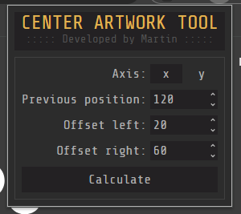
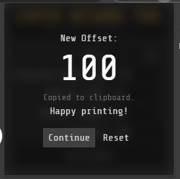

# Center Artwork Tool

A minimal utility web app for centering artwork objects based on previous position and two offsets.

---

<div style="display: grid; grid-template-columns: 1fr 1fr; ">
  
  
</div>

---

This tool is **specific to the software used by our company**, which expects an **inversed offset** calculation due to how the coordinate system is implemented internally.

---

## Usage

1. Input:
   - Previous position (X or Y)
   - Offset start (left/top)
   - Offset end (right/bottom)
2. Press **Calculate**
3. Result is automatically copied to the clipboard

---

## Calculation logic

```ts
shift = (offsetStart + offsetEnd) / 2 - offsetStart
newPosition = previousPosition - shift
```

The subtraction in the last step is intentional and reflects how our internal software interprets offset direction.

---

## Example

If:

```ts
previousPosition = 120
offsetStart = 20
offsetEnd = 60
```

Then:

```ts
shift = (20 + 60) / 2 - 20 = 20
newPosition = 120 - 20 = 100
```

---

## Tech stack

- React + TypeScript
- TailwindCSS
- No dependencies, no backend

---

> Built in one evening after work. Could have made code more modular, added info tool-tips, image representation of required input values, etc...
